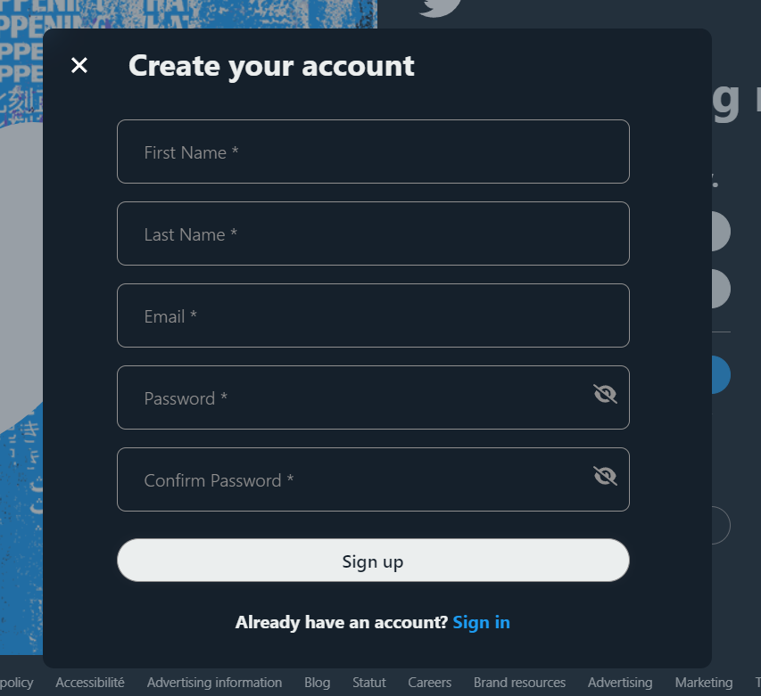
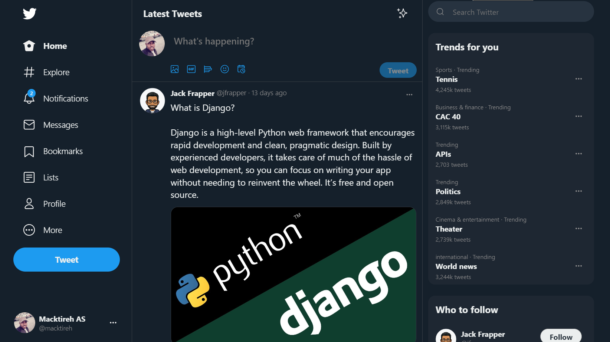
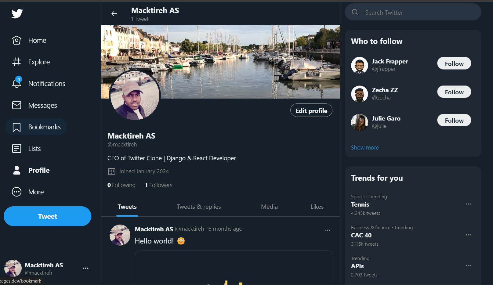
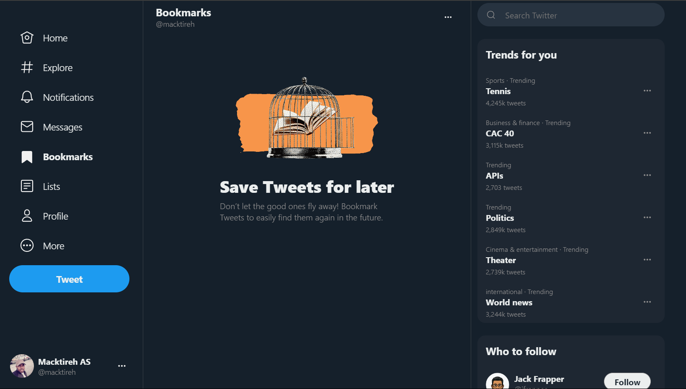

<p align="center"> <h1 align="center">Frontend Twitter Clone</h1> </p>


<p align="center">
  <!--  -->
  
  
  
  
  
  
  
  
  
  
  
  
  
  
  
  
</p>

## Table of Contents
- [Description](#description)
- [Features](#features)
- [Prerequisites](#prerequisites)
- [Getting Started](#getting-started)


## Description

This project provides the frontend for a Twitter clone. It is built using React, Redux, Axios for state management and API requests. The application is fully responsive and works seamlessly on various devices. It also supports PWA features, allowing it to be installed on devices for a native-like experience.

The backend for this project is implemented using Django, Django REST framework, Django Channels, PostgreSQL, Redis, and Cloudinary, and can be found [clone-twitter-backend](https://github.com/Macktireh/clone-twitter-backend).


## Features

- **Authentication**: User signup, login, and logout.
- **Tweets**: Create, read, update, and delete tweets.
- **Likes**: Like and unlike tweets.
- **Bookmarks**: Bookmark and remove bookmarks from tweets.
- **Retweets**: Retweet and undo retweet.
- **User Profiles**: View and edit user profiles, follow and unfollow users.
- **Notifications**: Real-time notifications for user interactions.
- **Real-Time Chat**: Real-time chat feature using WebSockets.
- **Responsive Design**: Fully responsive layout for various screen sizes.
- **PWA**: Progressive Web App support for a native-like experience.


## Prerequisites

- Node.js
- npm


## Getting Started

1. Clone the repository:

```sh
git clone https://github.com/Macktireh/clone-twitter-backend.git
```
```sh
cd clone-twitter-backend
```

2. Install dependencies:

```bash
npm install
```

3. Start the development server:

```bash
npm start
```

The frontend of your Twitter clone should now be up and running. Visit http://localhost:3000 to see the application in action. 🎉


## License

This project is licensed under the [MIT License](LICENSE).